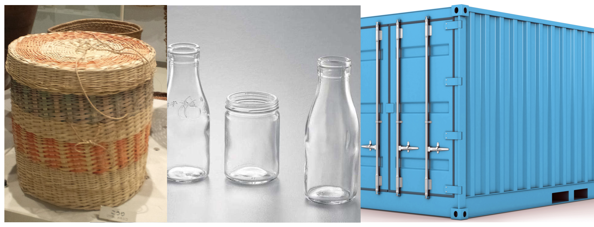
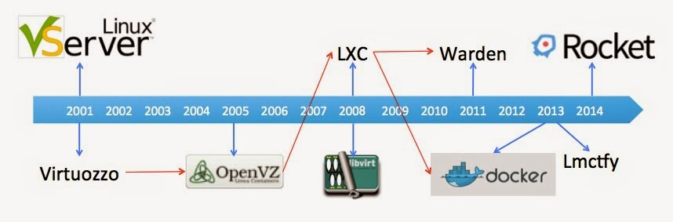

<!-- $theme: default -->
<!-- $size: 16:9 -->
<!-- footer: @jolestar -->

# Kubernetes 完全教程 预备课
## Docker 以及 Docker 网络
### 王渊命  @jolestar

 

---
# Agenda

1. 容器是什么？
1. 手动打造一个 Docker
1. Kubernetes 中的 Pod 和容器的关系
1. 后续 Kubernetes 课程介绍

 

---
# 容器是什么？



 

---
# 技术领域的容器（Container)

- List/Heap/Queue/Set
- J2ee Web Container
- Linux Container（LXC，Docker)


---
# 容器的特性

- 让不标准的物品标准化（杂物，水，应用）
- 给上层工具提供标准化的操作方式，屏蔽细节
	- 包装，运输
	- add/remove/iterator（复用算法）
	- 应用管理和调度

 

---
# 容器（Linux Container）的历史



 

---
# Docker (Moby)  如何实现应用标准化

| 问题        | 现状         |Docker 的方案  |
| -------------| ---------- |:-------------|
|安装包| war/jar，rpm/deb, src, bin|Image/Image Layer |
|运行环境|jvm，php, ruby, python| Image/Image Layer|
|进程启动方式  |web container, cmd, script |Image ENTRYPOINT/CMD|
|进程资源隔离限制| |Namespace/CGroup|
|进程文件路径冲突| |Chroot|
|端口冲突| 修改配置 |Network（IP per Container）|
|日志输出| 文件|stderr/stdout|
|安装包的仓库| nexus, rpm rep，ftp|Docker Registry|


 

---
# 手动打造一个 Docker -- Xocker

 

---
# 安装 Docker 以及一些工具

```console
apt-get update

apt-get install -y ebtables socat apt-transport-https bash-completion ntp wget bridge-utils cgroup-tools tree

apt-key adv --keyserver hkp://p80.pool.sks-keyservers.net:80 --recv-keys 58118E89F3A912897C070ADBF76221572C52609D
apt-add-repository 'deb https://apt.dockerproject.org/repo ubuntu-xenial main'

apt-get update

apt-cache policy docker-engine
apt-get install -y docker-engine
```
 

---
# 准备目录以及一个 Docker 镜像

```console
mkdir /var/lib/xocker/
mkdir /var/lib/xocker/image

docker pull busybox:glibc
docker pull jolestar/go-probe
docker pull jolestar/dockerbox
docker images
docker image save busybox:glibc -o busybox.tar
mkdir busybox
tar -xvf busybox.tar -C busybox/
```
解压 Image，分析构成，以及把其中的 Image Layer 解压，并移动到 /var/lib/xocker/image/busybox/

 

---
# 分层文件系统
先看看 chroot 的效果

```console
# 先备份一下
cp -r /var/lib/xocker/image/busybox/ /var/lib/xocker/image/busybox.bak
chroot /var/lib/xocker/image/busybox/ /bin/sh
# 执行 rm -rf *, 然后退出看看效果
# 恢复回来
cp /var/lib/xocker/image/busybox.bak /var/lib/xocker/image/busybox
```
再看 aufs 的工作原理

```console
mkdir -p /var/lib/xocker/mnt/1
mkdir -p /var/lib/xocker/mnt/1-data
mkdir -p /var/lib/xocker/mnt/1-init
mkdir -p /var/lib/xocker/mnt/1-init/etc/ && mkdir -p /var/lib/xocker/mnt/1-init/proc && echo "hello" > /var/lib/xocker/mnt/1-init/etc/myinit && tree /var/lib/xocker/mnt/1-init
mount -t aufs -o dirs=/var/lib/xocker/mnt/1-data:/var/lib/xocker/mnt/1-init:/var/lib/xocker/image/busybox none /var/lib/xocker/mnt/1
chroot /var/lib/xocker/mnt/1 /bin/sh
touch /tmp/test.data
rm /etc/myinit
```
---

# 容器网络

准备一个 bridge
```console 
brctl addbr xocker0
ip addr add 172.18.0.1/24 dev xocker0
ip link set dev xocker0 up
```
准备 veth peer
```console
ip link add dev veth0_1 type veth peer name veth1_1
ip link set dev veth0_1 up
ip link set veth0_1 master xocker0
ip netns add netns_test
ip link set veth1_1 netns netns_test
ip netns exec netns_test ip link set dev lo up
ip netns exec netns_test ip link set veth1_1 address 02:42:ac:11:00:01
ip netns exec netns_test ip addr add 172.18.0.2/24 dev veth1_1
ip netns exec netns_test ip link set dev veth1_1 up
ip netns exec netns_test ip route add default via 172.18.0.2
```
 

---

# CGroup/Namespace Run

```console
cgcreate -g cpu,cpuacct,memory:/test
cgexec -g "cpu,cpuacct,memory:/test"  ip netns exec netns_test unshare -fmuip --mount-proc chroot "/var/lib/xocker/mnt/1" /bin/sh -c "/bin/mount -t proc proc /proc && /bin/sh"
```

 

---
# Kubernetes 中的 Pod 和容器的关系

```console
docker run -d --net=none --name pause busybox:glibc sleep 999999
# 创建 netns 文件夹连接
container_id="pause"
pid=$(docker inspect -f '{{.State.Pid}}' ${container_id})
mkdir -p /var/run/netns/
ln -sfT /proc/$pid/ns/net /var/run/netns/$container_id
# 创建网络
ip link add dev veth0_2 type veth peer name veth1_2
ip link set dev veth0_2 up
ip link set veth0_2 master xocker0
ip link set veth1_2 netns ${container_id}
ip netns exec ${container_id} ip link set veth1_2 address 02:42:ac:11:00:02
ip netns exec ${container_id} ip addr add 172.18.0.3/24 dev veth1_2
ip netns exec ${container_id} ip link set dev veth1_2 up
ip netns exec ${container_id} ip route add default via 172.18.0.1
# 进入容器看下网络
docker exec ${container_id} ifconfig
# 启动其他容器
docker run -d --net=container:pause --name go-probe jolestar/go-probe
docker run -it --net=container:pause --name cli jolestar/dockerbox bash
# 通过 curl 调用本地服务
curl http://localhost
netstat -ntpl
```
---
# iptables 和 Docker

```console
docker run -d -p 80:80 --name go-probe2 jolestar/go-probe
curl http://localhost

iptables -S -t nat
-A DOCKER ! -i docker0 -p tcp -m tcp --dport 80 -j DNAT --to-destination 172.17.0.2:80

```

 

---
# Docker Volume 映射

```console
ls /data
docker run -rm -it -v /data:/data --name cli2 jolestar/dockerbox bash
# 在容器中执行
touch test.data /data/
# 退出查看
ls /data
```
 

---
# 后续 Kubernetes 课程介绍

<div style="float:right">
<br/>
课程二维码<br/>
<a href="http://edu.csdn.net/course/detail/6080">http://edu.csdn.net/course/detail/6080</a>
</div>

1. Kubernetes 架构概述
1. Kubernetes 的安装和运维
1. Kubernetes 的网络和存储
1. Kubernetes 的 API Spec 以及安全机制
1. Kubernetes 的应用管理（案例）
1. Kubernetes 的日志监控与故障排除
1. Kubernetes 的扩展开发

 

---
### FAQ

个人博客: [http://jolestar.com](http://jolestar.com)


---


