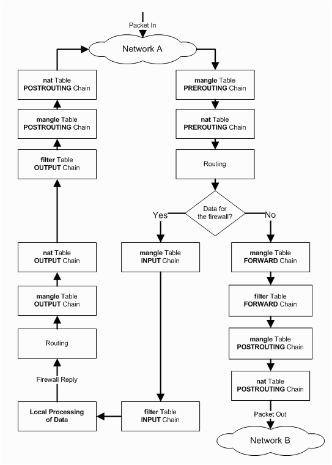
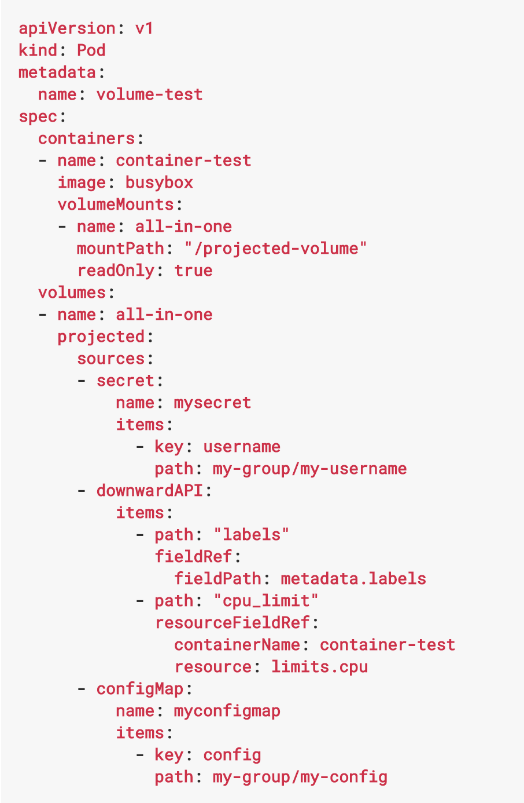

<!-- $theme: default -->
<!-- $size: 16:9 -->
<!-- footer: @jolestar -->


# Kubernetes 完全教程
## Kubernetes 网络与存储

### 王渊命 @jolestar

 

---
# Agenda

1. Kubernetes 的网络
    1. Kubernetes 网络概述
    1. Kubernetes 的 ClusterIP 机制
    1. Kubernetes 的网络规范 CNI
    1. 容器的跨主机网络
    1. Kubernetes 的网络，以 Flannel 为例
    1. QingCloud SDN Passthrough
    1. Kubernetes 网络故障排查
1. Kubernetes 的存储
	1. Kubernetes Volume
	1. Kubernetes PersistentVolume
	1. Kubernetes PersistentVolumeClaim  和 StorageClass


---
# Kubernetes 网络概述

1. Service ClusterIP
2. Pod 网络
	- 容器之间可以直接互通，不需要 NAT 
	- 节点可以和容器直接互通，不需要 NAT
	- 容器看到的自己 IP 应该和其他容器看到的一样

> **Network address translation (NAT)** is a method of remapping one IP address space into another by modifying network address information in Internet Protocol (IP) datagram packet headers while they are in transit across a traffic routing device.

---
# Service ClusterIP


---
# Iptables

>iptables是一个配置Linux内核防火墙的命令行工具，它基于内核的netfilter机制

Tables↓/Chains→               | PREROUTING | INPUT | FORWARD | OUTPUT | POSTROUTING
----------------------------- |:----------:|:-----:|:-------:|:------:|:-----------:      
**raw**                       |     ✓      |       |         |   ✓    |            
(connection tracking) |     ✓      |       |         |   ✓    |            
**mangle**                    |     ✓      |   ✓   |    ✓    |   ✓    |      ✓     
**nat** (DNAT)                |     ✓      |       |         |   ✓    |            
**filter** (default)                    |            |   ✓   |    ✓    |   ✓    |            
**security**                  |            |   ✓   |    ✓    |   ✓    |            
**nat** (SNAT)                |            |   ✓   |         |        |      ✓     


---
# Iptables data flow



---
# Iptables example Docker

```console
iptables -A INPUT -p tcp --dport 22 -j ACCEPT

iptables -P INPUT DROP
iptables -P FORWARD DROP

# docker iptables nat

iptables -S -t nat

-N DOCKER
-A PREROUTING -m addrtype --dst-type LOCAL -j DOCKER
-A OUTPUT ! -d 127.0.0.0/8 -m addrtype --dst-type LOCAL -j DOCKER
-A POSTROUTING -s 172.17.0.0/16 ! -o docker0 -j MASQUERADE
-A DOCKER ! -i docker0 -p tcp -m tcp --dport 80 -j DNAT --to-destination 172.17.0.2:80

```

---
# Iptables example Kubernetes ClusterIP

```console
kubectl get service
NAME         CLUSTER-IP       EXTERNAL-IP   PORT(S)        AGE
helloworld   10.105.189.133   <nodes>       80:31061/TCP   1d
```

```console
-N KUBE-NODEPORTS
-N KUBE-POSTROUTING

-N KUBE-SERVICES
-N KUBE-SVC-2WB5SOAIQNMPIUJO

-A PREROUTING -m comment --comment "kubernetes service portals" -j KUBE-SERVICES
-A OUTPUT -m comment --comment "kubernetes service portals" -j KUBE-SERVICES
-A POSTROUTING -m comment --comment "kubernetes postrouting rules" -j KUBE-POSTROUTING

-A KUBE-NODEPORTS -p tcp -m comment --comment "default/helloworld:" -m tcp --dport 31061 -j KUBE-SVC-2WB5SOAIQNMPIUJO
-A KUBE-SERVICES -d 10.105.189.133/32 -p tcp -m comment --comment "default/helloworld: cluster IP" -m tcp --dport 80 -j KUBE-SVC-2WB5SOAIQNMPIUJO
-A KUBE-SVC-2WB5SOAIQNMPIUJO -m comment --comment "default/helloworld:"-j KUBE-SEP-3F6YTS3NO7JJQOGS
-A KUBE-SEP-3F6YTS3NO7JJQOGS -p tcp -m comment --comment "default/helloworld:" -m tcp -j DNAT --to-destination 10.244.1.3:80

```


---
# CNI (Container Network Interface)

```console
CNI_COMMAND (add/del)
CNI_PATH (/opt/cni/bin)
CNI_CONTAINERID
CNI_NETNS
```
```console
$ cat /etc/cni/net.d/10-mynet.conf
{
	"cniVersion": "0.2.0",
	"name": "mynet",
	"type": "bridge",
	"bridge": "cni0",
	"isGateway": true,
	"ipMasq": true,
	"ipam": {
		"type": "host-local",
		"subnet": "10.22.0.0/16",
		"routes": [
			{ "dst": "0.0.0.0/0" }
		]
	}
}
```

---
# 容器的跨主机网络

1. 容器网络（详情参看预备课）
1. 容器的跨主机网络需要解决的问题
	1. IP 分配
	1. 跨主机网络数据转发
1. 手动实现跨主机容器网络（演示）

```console
node1(192.168.0.11) docker: 172.17.0.0/16
node2(192.168.0.12) docker: 172.18.0.0/16 (/etc/docker/daemon.json {"bip":"172.18.0.1/16"})

# node1
iptables -P FORWARD ACCEPT
ip route add 172.18.0.0/16 via 192.168.0.12
# node2
iptables -P FORWARD ACCEPT
ip route add 172.17.0.0/16 via 192.168.0.11
```


---
# Flannel

<div style="float:right">

</div>

Backend Type
1. udp
2. vxlan
2. host-gw
3. aws-vpc


---
# QingCloud SDN Passthrough

创建一个网卡(192.168.0.101)，绑定到主机，通过命令将网卡移动到容器的 netns

```console
container_id=$(docker run --network none -d jolestar/go-probe)
docker exec $container_id ifconfig
# 创建 netns 文件夹连接
pid=$(docker inspect -f '{{.State.Pid}}' ${container_id})
mkdir -p /var/run/netns/
ln -sfT /proc/$pid/ns/net /var/run/netns/$container_id
# 移动网卡并激活
ip link set eth1 netns ${container_id}
ip netns exec ${container_id} ip addr add 192.168.0.101/24 dev eth1
ip netns exec ${container_id} ip link set dev eth1 up
ip netns exec ${container_id} ip route add default via 192.168.0.1

docker exec $container_id ifconfig
docker exec $container_id -- nping 192.168.0.12
```


---
# Kubernetes 网络故障排查

1. 确认同一主机上的 pod 网络是否互通，否，排查本机网络 arp, iptables
1. 确认跨主机 pod 网络是否互通
1. 确认 dns 服务是否正常
1. 确认请求 Service ClusterIP 是否正常 （排查 Service iptables) 
1. 确认 pod 到 apiserver 请求是否正常
1. 确认出 pod 请求公网是否正常

```console
# iptables debug
iptables -t raw -A PREROUTING -s 172.17.0.0/16 -j TRACE
iptables -t nat -A POSTROUTING -p tcp -m tcp -d 172.17.0.0/16 -j LOG --log-prefix "POSTROUTING"
tail -f /var/log/kern.log
```

---
# Kubernetes 网络故障排查工具

- arp/arping
- ping/nping/traceroute
- iproute2
- nmap/telnet/curl
- nslookup/dig
- tcpdump
- iptables

```console
# iptables debug
iptables -t raw -A PREROUTING -s 172.17.0.0/16 -j TRACE
iptables -t nat -A POSTROUTING -p tcp -m tcp -d 172.17.0.0/16 -j LOG --log-prefix "POSTROUTING"
tail -f /var/log/kern.log
```

---
# Kubernetes Volume

```yaml
apiVersion: v1
kind: Pod
metadata:
  name: test-pd
spec:
  containers:
  - image: jolestar/go-probe
    name: test-container
    volumeMounts:
    - mountPath: /cache
      name: cache-volume
  volumes:
  - name: cache-volume
    emptyDir: {}
```

---
# Kubernetes Volume

- emptyDir
- hostPath
	```yaml
    volumes:
    - name: test-volume
    hostPath:
      path: /data
    ```
- downwardAPI
- secret
- configMap

---
# Kubernetes Volume

<div style="float:right">

</div>


- projected (secret, downwardAPI, configMap)
- gitRepo
```yaml
volumes:
  - name: git-volume
    gitRepo:
      repository: "git@xxxx:me/my-repo.git"
      revision: "22f1d8406d464"
```

---
# Kubernetes Volume

- NFS/CephFS/Glusterfs
```yaml
volumes:
  - name: nfs-volume
    nfs:
      path: /opt/nfs
      server: nfs.f22 
```
- Cloud Disk(GCEPersistentDisk, AWSElasticBlockStore, AzureDisk)
```yaml
volumes:
  - name: test-volume
    awsElasticBlockStore:
      volumeID: <volume-id>
      fsType: ext4
```

---
# Kubernetes VolumeMount Option
- mountPath
- name
- readOnly
- subPath

---
# PersistentVolume 以及 PersistentVolumeClaim

以及为什么要有 PersistentVolume，PersistentVolumeClaim

- 生命周期管理
- 资源清理以及复用
- Pod 副本
- 环境


---
# Kubernetes PersistentVolume 规范

```yaml
kind: PersistentVolume
apiVersion: v1
metadata:
  name: qingcloud-pv
  labels:
    type: qingcloud
spec:
  capacity:
    storage: 10Gi
  accessModes:
    - ReadWriteOnce
  flexVolume:
      driver: "qingcloud/flex-volume"
      fsType: "ext4"
      options:
        volumeID: "vol-xxxx
```

---
# Kubernetes PersistentVolume 规范

- Capacity
- Access Modes
	- ReadWriteOnce
	- ReadOnlyMany
	- ReadWriteMany
- Mount Options
- Phase （Available，Bound，Released，Failed）

---
# Kubernetes PersistentVolumeClaim 规范

```yaml
kind: PersistentVolumeClaim
apiVersion: v1
metadata:
  name: qingcloud-pvc
spec:
  storageClassName: qingcloud-storageclass
  persistentVolumeReclaimPolicy: Recycle
  accessModes:
    - ReadWriteOnce
  resources:
    requests:
      storage: 3Gi
```
```yaml
volumes:
  - name: wordpress-persistent-storage
    persistentVolumeClaim:
       claimName: qingcloud-pvc
```

Reclaim Policy (Retain,Recycle,Delete)

---
# Kubernetes StorageClass 规范

```yaml
kind: StorageClass
apiVersion: storage.k8s.io/v1
metadata:
  name: qingcloud-storageclass
  annotations:
      storageclass.kubernetes.io/is-default-class: "true"
provisioner: qingcloud/volume-provisioner
```
```yaml
apiVersion: storage.k8s.io/v1
kind: StorageClass
metadata:
  name: slow
provisioner: kubernetes.io/glusterfs
parameters:
  resturl: "http://192.168.10.100:8080"
  restuser: ""
  secretNamespace: ""
  secretName: ""
allowVolumeExpansion: true
```

---
# 作业

1. 尝试另外一种网络方案，比如 calico，分析其实现方式，并进行简单的性能比较。
1. 尝试在 Kubernetes 上运行 glusterfs server，并在 Kubernetes 中使用。


---
# 参考资料

1. [https://github.com/feiskyer/sdn-handbook](https://github.com/feiskyer/sdn-handbook)
2. 《Linux iptables Pocket Reference》Gregor N. Purdy
3. 《图解 TCP/IP 》[日]竹下隆史 / [日]村山公保 / [日]荒井透 / [日]苅田幸雄 
4. 《计算机网络：自顶向下方法》[美] James F.Kurose / [美] Keith W.Ross 


---
### 关于我

个人博客: [http://jolestar.com](http://jolestar.com)
课程 Github：[https://github.com/jolestar/kubernetes-complete-course](https://github.com/jolestar/kubernetes-complete-course)


---


