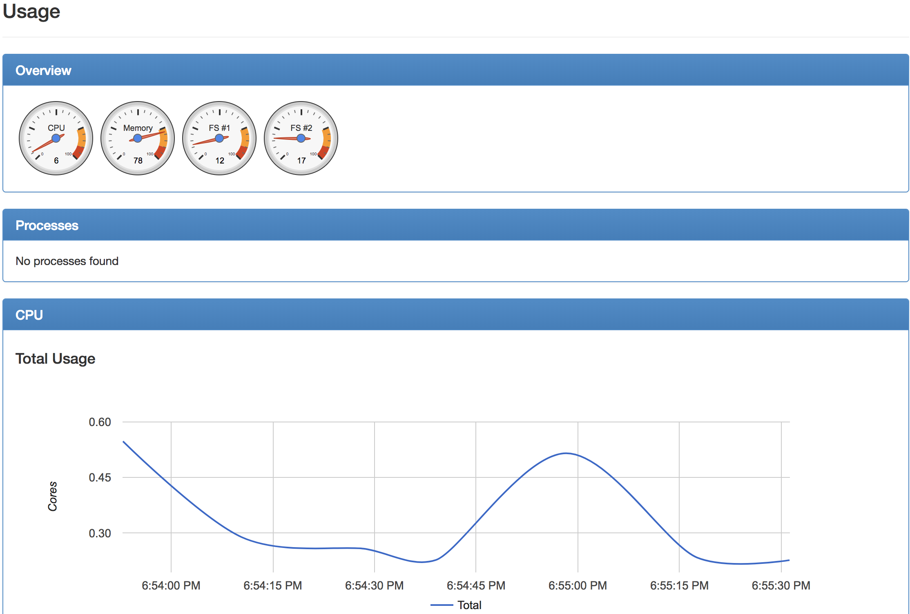
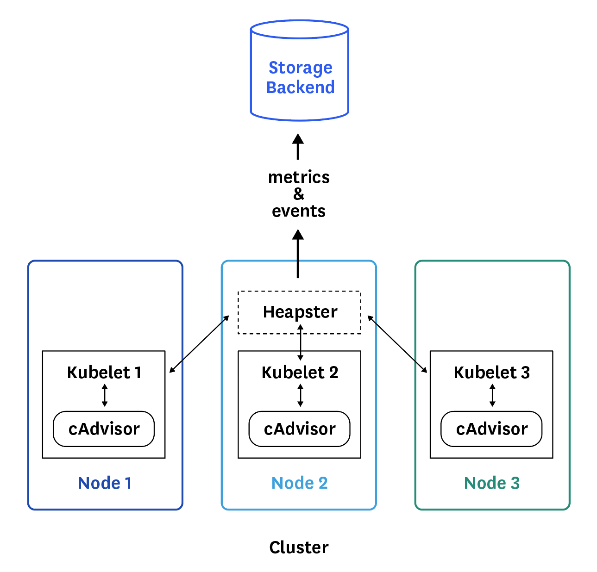
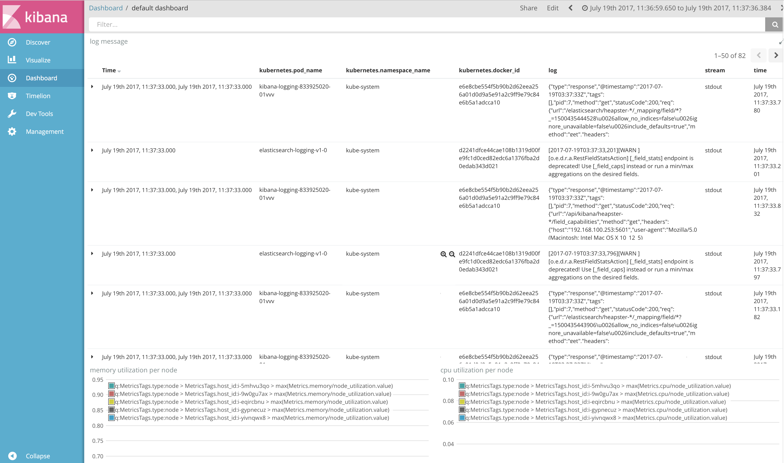

<style type="text/css">
.slide {
	background: #fff !important;
}
</style>
<!-- $theme: gaia -->
<!-- $size: 16:9 -->
<!-- footer: @jolestar -->


# Kubernetes 完全教程
## Kubernetes 的监控日志以及故障排查

### 王渊命 @jolestar

 

---
# Agenda

1. Kubernetes 的监控与日志收集
	- 监控
	- 日志收集
1. Kubernetes 的故障排查
	- 故障排查工具
	- 集群相关故障
	- 应用程序相关故障 

---
#### Kubernetes 监控概览


---
# Kubernetes 监控涉及的组件

1. Cadvisor
2. Kubelet Stats/Metrics API
3. Heapster
4. 自定义监控数据和自动伸缩
4. Kube-state-metrics
5. Prometheus
6. Grafana

---

<div style="float:right;position:absolute;top:200px;left:500px">

</div>

# Cadvisor
- https://github.com/google/cadvisor
- http://nodeip:4194/
	- ContainerState
	- PodState
	- ImageFS 

---
# Kubelet State API
- https://nodeip:10250/stats/
	- /container/
	- /summary/
- https://nodeip:10250/metrics/ 
- 数据项
	- filesystem
	- network
	- cpu
	- memory

---
# Heapster

<div style="float:right;position:absolute;top:0px;left:500px">

<small>https://www.datadoghq.com/blog/how-to-collect-and-graph-kubernetes-metrics/</small>
</div>

- Backend(Sinks)
	-  elasticsearch
	-  influxdb
	-  kafka
	-  opentsdb
	-  stackdriver

- Kube-state-metrics 
生成新的 metrics

---
# 自定义监控数据和自动伸缩

- [Arbitrary/Custom Metrics in the Horizontal Pod Autoscaler](https://github.com/kubernetes/features/issues/117)
- 基于自定义 API 机制
- 早期的 Custom Metrics 已经废弃

---
# Prometheus

<div style="float:right;position:absolute;top:50px;left:370px">

<small>https://github.com/prometheus/prometheus</small>
</div>

- Metrics Type
- Metrics Data Model(Label)
- Metrics SDK(Kubelet,etc..)
- Metrics Storage
- Metrics Query
- AlertManager
- Web UI

---
# Kubernetes 日志概览

- Container Log
- Kubectl log
- 日志收集工具

---
# Container Log

- Container stdout/stderr
- Docker Logger Driver (syslog, **journal, json-file**)
- Log Sidecar
	```yanl
    name: logsidecar
    image: busybox:1.27.1
    args: [/bin/sh, -c, 'tail -n+1 -F /var/log/logdir/logfile']
    ```
---
# Kubectl log
- Kubelet log api
	- https://nodeip:10250/logs/pods/ 	
- Pod log: /var/log/containers/<pod_name>_<pod_namespace>_<container_name>-<container_id>.log

---
# 日志收集工具

- fluent/fluent-bit
	- http://fluentbit.io/
	- DaemonSet
	- Mount host /var/log
	- kubernetes filter (lables/annotations)
- filebeat
	- https://github.com/elastic/beats
	
---
# 监控日志汇总存储查询

<div style="float:right;position:absolute;top:100px;left:370px">

</div>

- Elasitcsearch
- HDFS
- Kafka
- Kibana
- Grafana

---
# Kubernetes 故障排查

- 故障排查工具
- 集群相关故障
- 应用程序相关故障

---
# 故障排查工具

- kubectl describe
- kubectl logs
- kubectl exec
- Toolbox docker image
- 网络诊断工具

---
# 集群相关故障

- 网络与 ClusterIP (参看第三课 Kubernetes 的网络和存储)
- Kubernetes 系统日志
- 节点变为 NoReady

---
# 应用程序相关故障

- kubectl apply/create 报错
	- apiserver 和 etcd 
	- 排查参数和yaml（api 版本）
		```console
        Deployment in version "v1beta2" cannot be handled as a Deployment:
        no kind "Deployment" is registered for version "apps/v1beta2"
        ```
    - 通过 kubectl api-versions 确认当前集群支持的版本
	- 排查 Admission 设置
- 提交 Deployment 成功，但通过 kubectl 看不到 pod
	- 确认 controller-manager 状态


---
# 应用程序相关故障

- Pod 一直是 Init:XX 状态
	- 排查 init-container 
- Pod 一直是 Pending 状态 
	- 通过 kubectl describe 查看 event，确认具体原因
- Pod 一直是 ContainerCreating 状态
	- 确认镜像以及镜像仓库（墙）
- Pod 一直 CrashLoopBackOff
	- 确认镜像的 command 以及 arg 设置正确
	- 通过 kubectl log/kubectl log --previous 查看具体的日志错误
	- 通过 docker 排查

---
# Kubernetes Debug Container

- [Propose a feature to troubleshoot running pods](https://github.com/kubernetes/community/pull/649)
- https://github.com/kubernetes/kubernetes/pull/46243
- Kubernetes 1.9

```console
kubectl debug -c debug-shell --image=debian target-pod -- bash
```


---
# 总结

对 Kubernetes 的监控与日志有一个整体的了解，以及熟悉解决 Kubernetes 故障的方式


---
# 演示

Kubernetes 的日志与监控
- cAdvisor
- https://github.com/QingCloudAppcenter/kubernetes/tree/master/k8s/addons/monitor

---
# 作业


1. 通过 Kubernetes 搭建一个监控与日志收集分析系统，可以参考：https://github.com/QingCloudAppcenter/kubernetes/tree/master/k8s/addons/monitor
2. 试图去看一下 Kubernetes 的源码，初步了解一下 Kubernets 插件开发相关的知识


---
### 关于我

个人博客: [http://jolestar.com](http://jolestar.com)
课程 Github：[https://github.com/jolestar/kubernetes-complete-course]
(https://github.com/jolestar/kubernetes-complete-course)
课程 QQ 群: 451252952


---


