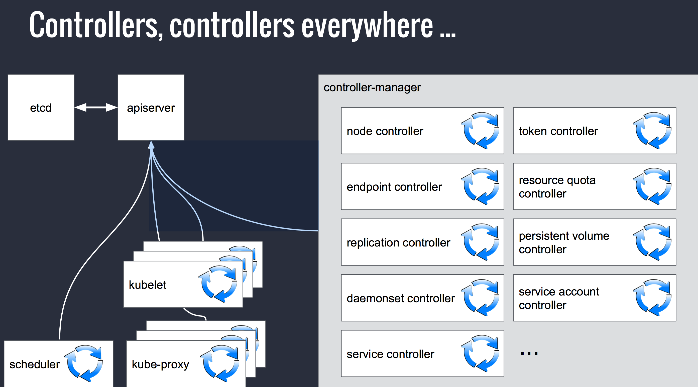

<!-- $theme: default -->
<!-- $size: 16:9 -->
<!-- footer: @jolestar -->


# Kubernetes & MicroService
#### 王渊命 @jolestar 青云容器平台负责人

 

---

# 微服务带来的变化

- 部署单元
- 依赖方式
- 架构模式

 

---
# 微服务涉及的技术点

- 服务发现 服务目录 服务列表 配置中心
- 服务生命周期 变更，升级
- 服务依赖关系
- 链路跟踪 限流 降级 熔断
- 访问控制


 

---
# 为微服务而生的 Kubernetes

- Kubernetes 架构
- Kubernetes Pod - Sidecar 模式
- Kubernetes 支持微服务的一些特性
- 微服务集大成之 istio

 

---
# Kubernetes 架构

- 一个状态存储
- 多个控制器

 

---

 

<small>图片来源: https://www.slideshare.net/sttts/kubernetes-architecture-and-introduction-paris-kubernetes-meetup</small>

---
# Kubernetes 的 Pod - Sidecar 模式

```yaml
apiVersion: v1
kind: Pod
metadata:
  name: mypod
spec:
  containers:
  - name: webserver
    image: ubuntu
    workingDir: /tmp/mypod
    command: ["python3", "-m", "http.server", "80"]
    volumeMounts:
    - name: htdocs
      mountPath: /tmp/mypod
  - name: busybox
    image: sttts/busybox-curl
    volumeMounts:
    - name: htdocs
      mountPath: /tmp/mypod
  volumes:
  - name: htdocs
hostPath:
path: /tmp/mypod
```

---
# Kubernetes 的 Pod - Sidecar 模式


---
# Sidecar 模式

- 方便更细粒度的拆解服务，降低运维管理成本
- 提供一种非侵入的方式来扩展服务

 

---
# 服务发现

## Service , ClusterIP 以及 DNS
## ServiceAccount and Kubernetes-API

 

---
# Service , ClusterIP 以及 DNS

```yaml
apiVersion: v1
kind: Service
metadata:
  name: myservice
spec:
  ports:
  - port: 80
    protocol: TCP
    targetPort: 9376
  selector:
    app: my-app
  clusterIP: 10.96.0.11
```
```console
curl http://myservice
```

 

---
# Service , ClusterIP 以及 DNS

</img>

---
# Service , ClusterIP 以及 DNS

- kube-dns
- dnsmasq
- dns-sidecar

```console
cat /etc/resolv.con

nameserver 10.96.0.10
search default.svc.cluster.local svc.cluster.local cluster.local

```
 

---
# ServiceAccount and Kubernetes-API

```go
endpoints, _ = client.Core().Endpoints(namespace).Get("my-service", metav1.GetOptions{})
addrs := []string{}
for _, ss := range endpoints {
	for _, addr := range ss.Addresses {
		ips = append(addrs, fmt.Sprintf(`"%s"`, addr.IP))
	}
}
glog.Infof("Endpoints = %s", addrs)
```

 

---
# Leader 选举

- ETCD
- Zookeeper

 

---

# 通过 Kubernetes 进行 Leader 选举

- ResourceVersions
- Annotations
- Endpoint/ConfigMap
- Update/Replace
- Sidecar 方式 (https://github.com/kubernetes/contrib/tree/master/election)

```console
$ kubectl exec elector-sidecar -c nodejs -- wget -qO- http://localhost:8080
Master is elector-sidecar
```

 

---
# Kubernetes 支持微服务的运维特性

- 监控与日志收集
- 滚动升级
```console
kubectl set image deployment <deployment> <container>=<image>
kubectl rollout status deployment <deployment>
kubectl rollout pause deployment <deployment>
kubectl rollout resume deployment <deployment>
kubectl rollout undo deployment <deployment>
```
- 自动伸缩
```
kubectl autoscale deployment php-apache --cpu-percent=50 --min=1 --max=10
```

 

---
# 微服务集大成之 istio

- 智能路由以及负载均衡
- 流量加密、服务间认证
- 跨语言以及平台
- 全范围（Fleet-wide）策略执行
- 深度监控和报告 (Prometheus & Grafana, Zipkin)

 

---

# istio -- Service Mesh

- Visibility
- Resiliency
  - Timeouts/Retry
  - Circuit breakers
  - Health checks
    - Fault injection 
- Efficiency 
  - LoadBalancer
  - TLS offload
    - Proxy 
- Traffic Control
- Security
- Policy Enforcement

 

---
# istio 架构 -- Enject 魔法

</img>

---

# istio 服务依赖关系


BookInfo Service Graph

---
# 总结

- 架构问题，一层解决不了的时候就再抽象一层
- Kubernetes 提供了一种便于在服务之间增加控制层的能力

---
# 一个硬广告
## QingCloud Kubernetes 服务已经上线，欢迎试用

- 快速一键部署 Kubernetes 集群，原生 Kubernetes API
- 网络，存储和 IaaS 平台深度整合
- 内置监控以及日志收集组件

 

---
### 关于我

个人博客: [http://jolestar.com](http://jolestar.com)

