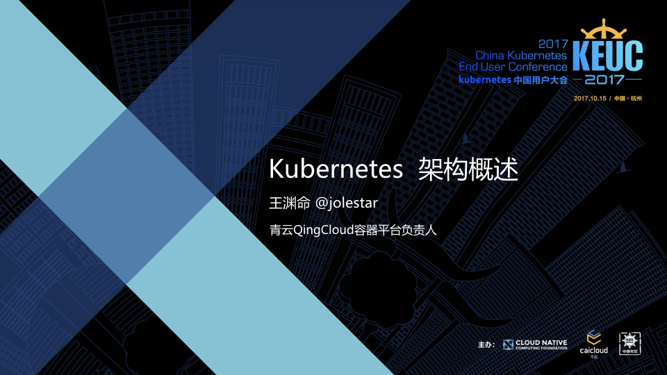
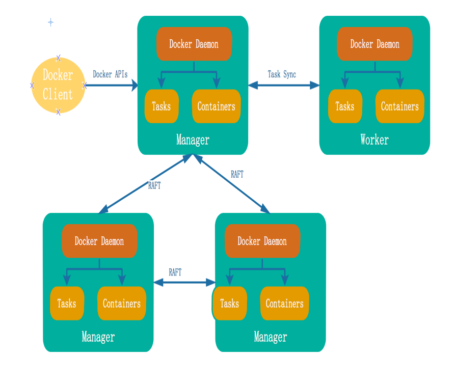
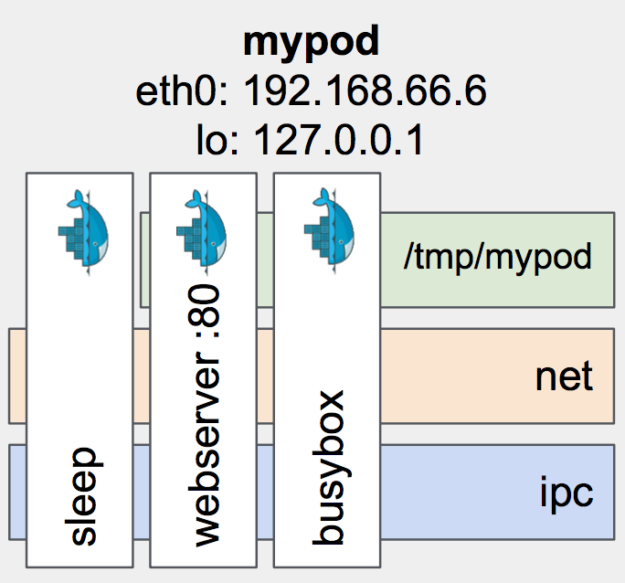
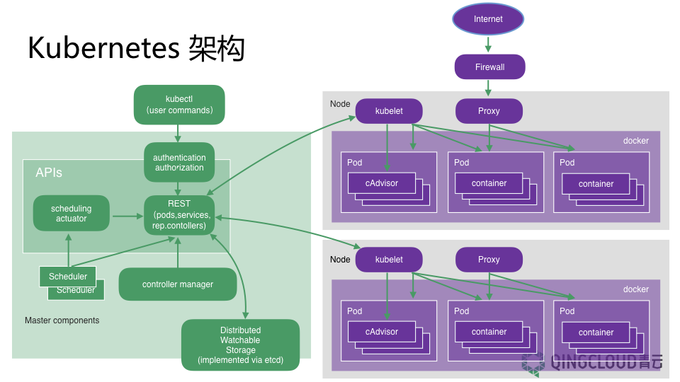
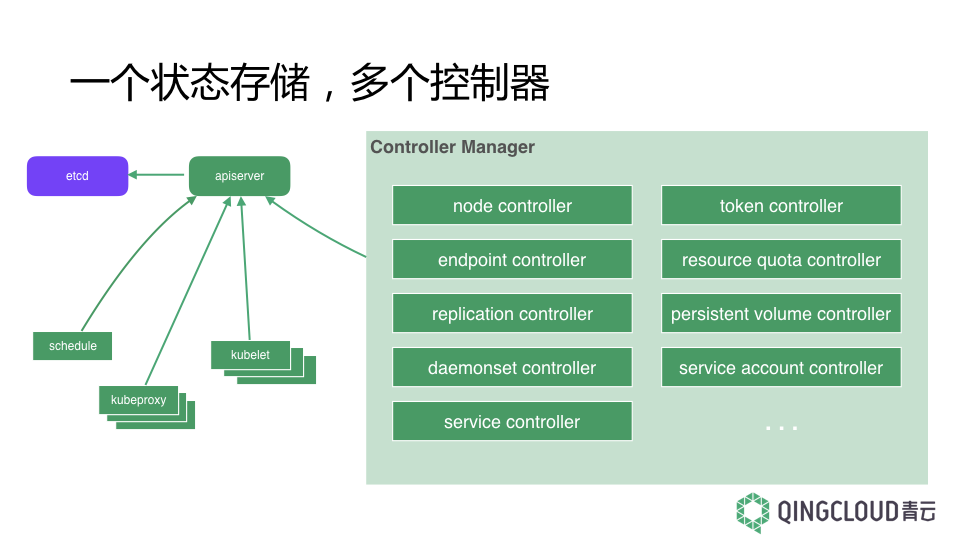

<style type="text/css">
.slide {
	background: #fff !important;
}
</style>
<!-- $theme: gaia -->
<!-- $width: 960 -->
<!-- $height: 540 -->
<!-- footer: @jolestar -->



---
# 个人介绍

- 王渊命 @jolestar 青云容器平台负责人，多栖程序员
- java/go/python
- 微博/通讯工具/协作工具/容器/云
- 技术写作者，https://jolestar.com
- Kubernetes "布道师"，《[Kubernetes 完全教程](http://edu.csdn.net/course/detail/6080)》作者

---
# Agenda

1. Kubernetes 为何而生
	-  Swarm, Mesos, Kubernetes
1. Kubernetes 的架构
 	- Pod
 	- 部署架构和逻辑架构
 	- API Spec Object
 	- 架构优劣

---
# Kubernetes 为何而生

- 云发展到一个新阶段
  - 按需的资源
  - 对应用无侵入
> 用户从关注资源的运维转向关注应用的开发运维成本
- 容器的普及奠定了基础
  - 应用安装包标准化
  - 进程管理标准化

> 用户需要一套系统来管理大规模的容器
---
# 容器编排系统应运而生

我们需要一种 **面向应用（Application Oriented）** 的系统来降低服务端应用的开发部署和运维成本

>We wanted people to be able to **program** for the data center just like they program for their laptop --Ben Hindman

我们再引申一下，从开发延伸到部署运维

We wanted people to be able to **manager app** for the data center just like they manager app on their laptop

---
# Swarm, Mesos, Kubernetes

1. Docker Swarm
1. Mesos
1. Borg, Omega, and Kubernetes

---
## Docker Swarm

<div style="float:right;"></div>

- 去中心化
- 组件内置 
- 配置简易

---
# Mesos

>define a minimal interface that enables efficient **resource sharing** across frameworks, and otherwise push control of task scheduling and execution to the frameworks 


---
# Mesos 

<div style="float:right"></div>

- 资源共享
- 编程框架
- 分布式调度

---
# Kubernetes

> Kubernetes is not a mere “orchestration system”; it eliminates the need for orchestration. The technical definition of “orchestration” is execution of a defined workflow: do A, then B, then C. In contrast, **Kubernetes is comprised of a set of independent, composable control processes that continuously drive current state towards the provided desired state.** It shouldn’t matter how you get from A to C: make it so. 

---
# Borg, Omega, and Kubernetes

- Borg: Container,BatchJob&Service
- Omega: State store,Multi control-plane
- Kubernetes: ApiServer,Pod,Network,Storage,OpenSource

---
# Swarm vs Mesos vs Kubernetes


---
# Kubernetes - 始于编排而超越编排

1. Kubernetes 的 Pod
1. Kubernetes 的部署架构
1. Kubernetes 的逻辑架构

---
# 从容器角度看 Pod

1. 启动 pause 容器
```console
docker run -d --net=none --name pause busybox sleep 999999
```
2. 通过 CNI 创建网络，然后移动到 pause 的 netns
3. 启动业务容器，关联到 pause
```console
docker run -d --net=container:pause --name web nginx
docker run -d --net=container:pause --name sidecar mysidecar
```
---
# 从容器角度看 Pod

<div style="float:right"></div>

1. 共享网络
2. 共享 Volume
3. 共享 IPC

---
## Pod Spec
```yaml
apiVersion: v1
kind: Pod
metadata:
  name: nginx
  labels:
    app: web
spec:
  containers:
  - name: nginx
    image: nginx:1.7.9
    ports:
    - containerPort: 80
  - name: sidecar
    image: mysidecar
```
---



---
# Kubernetes 逻辑架构

1. Declare，Observe，React
1. 一个状态存储
1. 多个控制器


---



---
## Pod 的创建流程


---
### Kubernetes 中的 API Spec Object
- Core
	- Pod/Container/Volume
	- Service 一组 Pod 对外提供能力的抽象
- Apps
	- Replica: 控制 Pod 的副本
	- Deployment: 控制 Replica 的版本（滚动升级）
	- DaemonSet: 绑定 Pod 和 Node 关系
	- StatefulSet: 控制 Pod 的网络标志以及存储
5. Autoscaling: HPA 根据监控条件控制 Deployment 的副本数属性

---
# Kubernetes 的架构优势

1. 自愈 （最终一致）
1. 组合 （低级组件组合成高级组件）
1. 面向未来 （API 定义目标，而不是过程）

---
# 一种面向未来的 Spec 设想

```yaml
apiVersion: vx
kind: ServiceSLA
metadata:
  name: myservice-sla
agreement:
  success: 999
  averageLatency: 200ms
  cost: x$/h
  selector:
    app: myapp
  
```

---
# Kubernetes 的架构劣势

1. 同步或者依赖操作
2. 非状态操作 

---
# Kubernetes 开放式问题

1. 配置管理
2. 服务依赖

---
# 相关资料
- [Mesos 架构以及源码浅析](http://jolestar.com/mesos-architecture/)
- [Borg, Omega, and Kubernetes](https://static.googleusercontent.com/media/research.google.com/en//pubs/archive/44843.pdf)
- [Declarative application management in Kubernetes](https://docs.google.com/document/d/1cLPGweVEYrVqQvBLJg6sxV-TrE5Rm2MNOBA_cxZP2WU)
- [The State of the Kubernetes Ecosystem](https://thenewstack.io/ebooks/kubernetes/state-of-kubernetes-ecosystem/)
- [Kubernetes lifecycle of a pod](https://dzone.com/articles/kubernetes-lifecycle-of-a-pod)
- [Kubernetes 完全教程](http://edu.csdn.net/course/detail/6080)
- [Swarm的进化和大规模应用](http://geek.csdn.net/news/detail/238936)

---

# ==Q&A==


